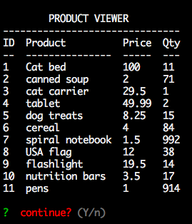
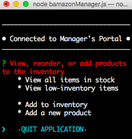
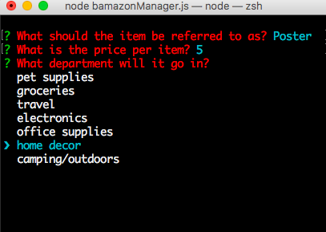

# **•–-- Bamazon --–•**
 The program runs in the terminal and takes in user input to query a local database. Users interact with the application through the Node.js package, `inquirer`. Inquirer provides a simple way to take in user input and use it to make *_mysql_* calls to the database. Inquirer relies on the asynchronicity of *_promises_* to construct the data objects before making the query. 

## *Required* configuration 
 
  Install   [npm](https://docs.npmjs.com/misc/developers) - Node Package Manager

  ### `mysql`  -<small style="margin-left:10px"> written for **version 5.7**</small>
    
  

  ### `Node.js` 
  npm packages should be installed in the <strong>root</strong> directory of your project

   ```bash
   npm install mysql console.table inquirer
   ``` 

   <br>
More information about the required packages can be found below:

  [npmjs.org/console.table](https://www.npmjs.com/package/console.table)<br>
  [npmjs.org/mysql](https://www.npmjs.com/package/mysql)<br>
  [github.com/inquirer.js](https://github.com/SBoudrias/Inquirer.js)


-----

## Bamazon Customer
### **`bamazonCustomer.js`** - Run the bamazon app as a customer 

Start the program by running 
>  `node bamazonCustomer.js`

The program allows users to simulate a simple CLI to interact with their inventory. Users can walk through the steps of adding items to their cart and purchasing the items online. The database will 


Keep track of the items you purchase as you shop through the _virtual Bamazon store_. 

## 2. Bamazon Manager

**Bamazon Manager** implements many of the same features as Bamazon Customer, while providing additional administrative privilledges. Managers can add new items, restock on existing products, and view the items that are almost out of stock. 

 

     